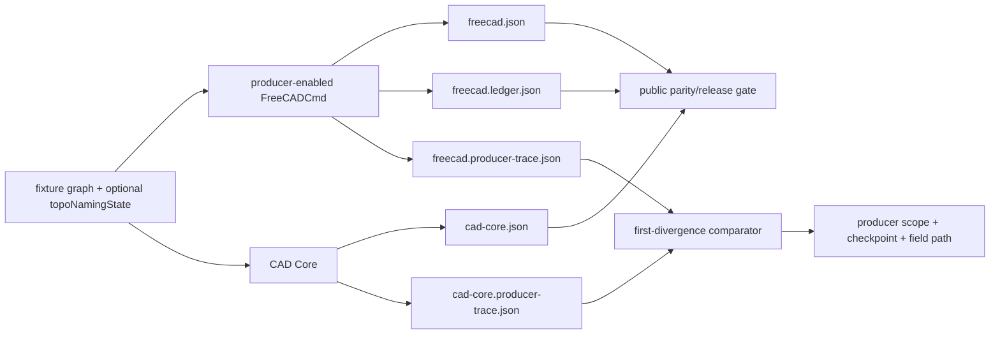

# FreeCAD 几何生态迁移工程 New

本工程包把“最终 CAD Core response 与 FreeCAD 不同”拆成可定位、可修复、可回归的 producer 过程差异。第一阶段不是直接写比较器，而是在 `cad-core` 内建立与 FreeCADCmd 同构的 ElementMap producer trace；只有两侧都能发布闭合过程证据后，第二阶段才比较并报告第一处分叉，第三阶段再按分叉位置推进几何语义迁移。

## 当前基线

- live baseline：2026-07-12，`/Users/li/Chili3DProject/FreeCAD` HEAD `05f14b6b0c`。
- 当前 worktree 已有大量用户改动，包括 `cad-core` 的 StringHasher、ElementMap、TopoShape、Sketch、PartDesign 与 C4M6 产物；本工程实施时必须先重新记录 live status，只复用和增量修改，不得回退或覆盖。
- FGM-N1 已完成 request-local recorder、默认 CAD Core trace sidecar、required slices 与共享闭包 validator；FGM-N2 comparator/CLI/report/parity 观察性集成已通过 focused 和 `/tmp` 代表验证。
- native corpus 当前有 480 对 public expected/ledger。方案编写期间 live worktree 新出现了全部 480 个 native `*.freecad.producer-trace.json`，目前均未被 Git 跟踪；这说明三侧批量采集已经发生，但在逐文件 closure/确定性验证和正式纳入前，不能直接宣称“480 个 producer 路径已权威闭包”。
- N2 尚未标记 `【已实现】`：默认 fixture tree 没有 CAD Core actual trace；现有 480 个 native trace 虽都有 request/response binding，但没有可重算的 canonical snapshot hash，且 native mapper/child snapshot 尚未发布 raw M/G/D 与 parent inventory/nested linkage。8 个代表 family 已用 `/tmp` 新采的 canonical-bound native trace 验证；probe contract 与正式 artifact 更新需另行授权。

## 权威顺序

1. `/Users/li/Chili3DProject/FreeCAD/src` 与 `/Users/li/Chili3DProject/FreeCAD2/src` 中对应 FreeCAD 类/函数是业务语义权威。
2. `/Users/li/Chili3DProject/FreeCAD2/docs/添加探针/7-11-23-05-FreeCADCmd-ElementMap生产者切片探针方案.md` 是 slice、checkpoint、只读旁路与闭包的完整探针规格。
3. `docs/框架/7-12-00-46-FreeCADCmd-ElementMap生产者Trace驱动CADCore实现指南.md` 规定 native trace 如何用于定位 CAD Core 实现，不作为建模输入。
4. 本工程包负责把上述权威映射成 CAD Core 模块、实施顺序、矩阵和验收门禁，不建立第二套业务语义。

## 工程分期

| 阶段 | 目标 | 产物 | 进入条件 |
| --- | --- | --- | --- |
| `FGM-N1` | CAD Core 默认记录并发布同构 ElementMap producer trace | `<case>.cad-core.producer-trace.json`、闭包 validator、focused tests | 立即开始 |
| `FGM-N2` | 比较 native expected trace 与 CAD Core actual trace，在第一处分叉 hard fail | `compare_element_map_producer_trace.py`、机器/人类报告 | N1 的 recorder、关键切片和 publisher 已闭合 |
| `FGM-N3` | 按首处分叉把 FreeCAD 语义放回 CAD Core 同构模块 | producer-family 迁移批次与 parity 收口 | N2 对代表 case 能稳定定位 |

必读文件：

| 文件 | 用途 |
| --- | --- |
| `FGM-N1-CADCore-ElementMap生产者切片探针/7-12-01-11-FGM-N1-CADCore-ElementMap生产者切片探针方案.md` | 首批完整实施规格；必须先完成 |
| `FGM-N1-CADCore-ElementMap生产者切片探针/矩阵/producer_trace_slice_matrix.tsv` | 全部 slice 与 CAD Core 落点，防止只做 recorder 骨架 |
| `FGM-N1-CADCore-ElementMap生产者切片探针/矩阵/producer_trace_blocker_queue.tsv` | N1 有序关闭队列 |
| `FGM-N2-ProducerTrace首分叉比较器/7-12-01-11-FGM-N2-ProducerTrace首分叉比较器方案.md` | 结构对齐、canonical projection 与首分叉报告规格 |
| `FGM-N3-按首分叉推进几何生态迁移/7-12-01-11-FGM-N3-按首分叉推进几何生态迁移方案.md` | 比较器就绪后的 producer-family 迁移循环 |

## 数据方向

trace 永远是只读诊断 sidecar。它不得进入 fixture 输入、Shape/BREP、普通 response、`topoNamingState`、public expected comparator 或 CAD Core 的建模决策。

## 与既有路线的关系

- C13-M3 已建立 `MappedNameProvenance` 等业务账本；N1 只观察并 snapshot 这些账本，不复制第二份业务状态。
- C13-M4/M5 继续负责 public expected/ledger 与 release parity；N2 是诊断工具，不改变其 verdict。
- C4N-S3 的 deterministic producer-tag 仍是业务语义任务。N1/N2 不宣称替代它，但涉及相同 `string_hasher/topo_shape` 文件时不得并行落代码；先由 N1 固化观察证据，再用 N2 的第一处分叉恢复 C4N-S3。
- `runtime` 和 adapter 只能调度/发布已存在的 trace artifact，不能在 response 阶段补造 producer event。

## 工程关闭规则

- 每阶段按各自方案的短跑、阶段回归和重型收口验收，不能以“文件已生成”代替语义闭包。
- 方案未完成前保持当前文件名；全部实现并验证后，保留时间前缀并重命名为 `【已实现】...`，同步更新矩阵状态和本 README。
- 不手改任何 `*.freecad.json`、`*.freecad.ledger.json`、`*.freecad.producer-trace.json` 追随 CAD Core；native artifact 只能由相应 collector 重生。
