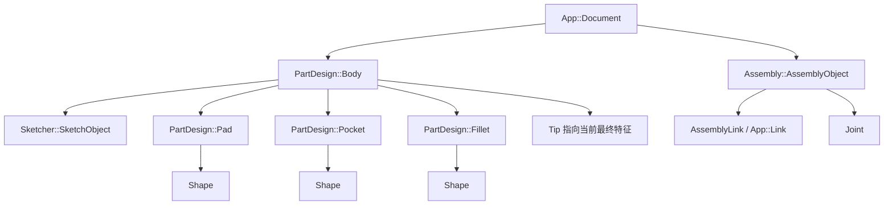
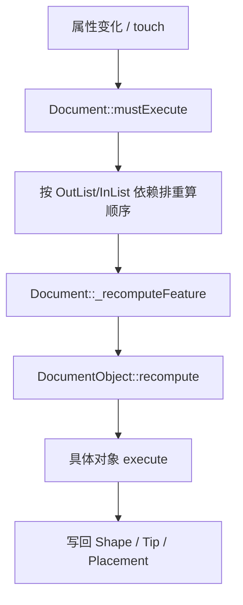

# 00-总览：一次建模到底发生了什么

## 一句话结论

FreeCAD 不是把几何一次性画死在屏幕上。它是在文档里放一串对象：草图对象负责二维轮廓，PartDesign 特征负责把轮廓变成实体，Body 负责把这些实体特征排成历史链，Assembly 再用 Link 和 Joint 把多个零件组织起来。

## 用户视角

用户看到的流程通常是这样：

1. 新建文档。
2. 新建 `Body`。
3. 在 Body 里新建 `Sketch`。
4. 画线、圆、矩形，添加尺寸和几何约束。
5. 用 Pad 把草图拉成实体。
6. 再用 Pocket、Hole、Fillet、Pattern 等特征继续加工实体。
7. 建多个零件后，把它们放进 Assembly。
8. 给组件之间加 Joint，最后求解装配位置。

界面上看起来像“画图”，源码里更像“创建对象、改属性、重算对象”。

## 对象视角

主线对象是：

- `App::Document`：一个 FreeCAD 文件里的对象容器。
- `App::DocumentObject`：所有可重算对象的共同底座。
- `Sketcher::SketchObject`：保存二维几何、约束、外部几何，重算后输出草图形状。
- `PartDesign::Body`：保存一组特征，`Tip` 指向当前最终结果。
- `PartDesign::Pad/Pocket/...`：真正生成或修改实体的特征对象。
- `Assembly::AssemblyObject`：装配体容器，负责组件、关节和求解。
- `Assembly::AssemblyLink`：装配里的引用件。

对象关系图：

## 几何视角

几何会一层层升级：

最重要的一点：PartDesign 的每一步通常不是直接改旧实体，而是生成一个新的特征结果，然后 Body 的 `Tip` 指向最新结果。

## 重算视角

用户改尺寸、改草图、改特征参数后，属性会被标记为 touched。`Document::recompute()` 会按依赖关系找出要执行的对象，然后调用每个对象的 `recompute()`，再进入对象自己的 `execute()`。

大致流程：

## 源码索引

- `src/App/Document.cpp`：`Document::addObject()`、`Document::recompute()`、`Document::_recomputeFeature()`。
- `src/App/DocumentObject.cpp`：`DocumentObject::touch()`、`DocumentObject::mustExecute()`、`DocumentObject::recompute()`、`DocumentObject::execute()`。
- `src/App/DocumentObject.cpp` / `src/App/PropertyLinks.cpp`：`getOutList()`、`getInList()` 和链接属性维护依赖。
- `src/Mod/Sketcher/App/SketchObject.cpp`：草图对象重算和输出 Shape。
- `src/Mod/PartDesign/App/Body.cpp`：Body 的 `Group`、`Tip`、`BaseFeature` 链。
- `src/Mod/PartDesign/App/FeatureExtrude.cpp`：Pad/Pocket 的主要拉伸实现。
- `src/Mod/Assembly/App/AssemblyObject.cpp`：装配求解主流程。

## 常见误区

- Body 不是最终实体本身，Body 里有很多对象，当前最终实体由 `Tip` 指向。
- Sketch 不是一张图片，它有 `Geometry`、`Constraints`、`ExternalGeometry` 和输出 `Shape`。
- Pad/Pocket 不只是“把草图拉一下”，它还要决定方向、长度、是否到某个面、是否和旧实体 fuse/cut。
- 装配体不是把实体复制一份，它主要通过 Link 引用零件，再通过 Joint 求解组件位置。

