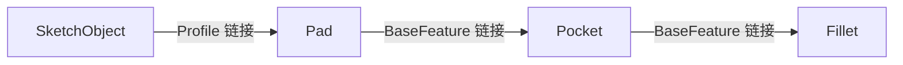
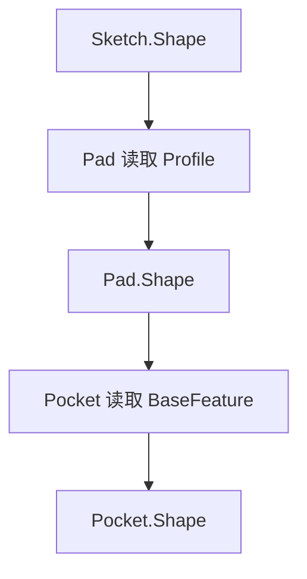
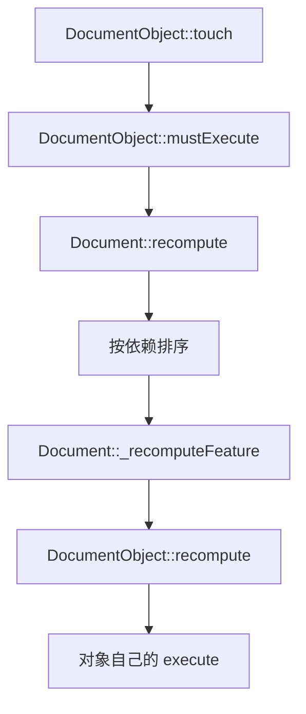

# 01-文档和对象：模型为什么能重算

## 一句话结论

FreeCAD 模型能重算，是因为模型不是一堆孤立几何，而是一组 `DocumentObject`。对象之间用属性链接起来，属性变了就标记对象需要重算，文档按依赖顺序调用对象的 `execute()`。

## 用户视角

用户改一个尺寸后，屏幕上的实体会跟着更新。实际发生的是：

1. 某个属性被改了，比如草图尺寸约束或 Pad 的 Length。
2. 对象进入 touched 状态。
3. 文档重算时找到这个对象和依赖它的后续对象。
4. 每个对象重新执行自己的生成逻辑。
5. 结果写回对象的输出属性，例如 `Shape`。

## 对象视角

`Document` 是容器，`DocumentObject` 是基本对象。`Document::addObject()` 按类型名创建对象，再由 `_addObject()` 放进文档。每个对象有一组属性，属性可以是普通值，也可以是指向其他对象的链接。

链接关系会形成依赖：

从对象自身看：

- `OutList`：我依赖谁。
- `InList`：谁依赖我。

`PropertyLinkBase` 在设置链接值时会维护反向链接，所以文档可以知道“改了 Sketch 后，Pad/Pocket/Fillet 也可能要重算”。

## 几何视角

`Part::Feature` 是很多几何对象的底座，它有一个 `Shape` 属性。上游对象重算后，下游对象再读上游的 `Shape`，继续生成自己的新 `Shape`。

## 重算视角

源码里重算链路很明确：

`DocumentObject::recompute()` 是通用外壳，具体结果由子类 `execute()` 决定。比如 Sketch 的 `execute()` 会解草图，Pad 的 `execute()` 会拉伸，Assembly 的 `solve()` 会更新组件位置。

## 源码索引

- `src/App/Document.h`：`Document::addObject()`、`Document::recompute()`、`Document::recomputeFeature()` 的接口。
- `src/App/Document.cpp`：`Document::addObject()`、`Document::_addObject()`、`Document::recompute()`、`Document::_recomputeFeature()`。
- `src/App/DocumentObject.h`：`mustExecute()`、`recompute()`、`execute()`、`getOutList()`、`getInList()`。
- `src/App/DocumentObject.cpp`：`touch()`、`mustExecute()`、`recompute()`、`execute()`、OutList/InList 查询。
- `src/App/PropertyLinks.cpp`：`PropertyLinkBase` 设置链接时调用 `_addBackLink()` / `_removeBackLink()`。
- `src/Mod/Part/App/PartFeature.h`：`Part::Feature` 的 `PropertyPartShape Shape`。

## 常见误区

- 重算不是“全文件从头乱跑”。文档会看 touched 状态和对象依赖。
- `execute()` 不是 UI 操作，它是对象重新生成结果的核心函数。
- `Shape` 是几何结果，普通参数属性只是生成这个结果的输入。

