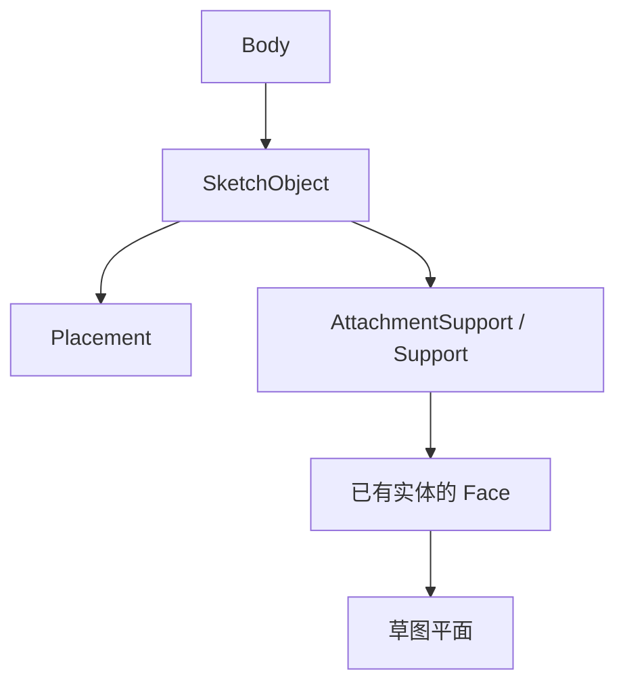
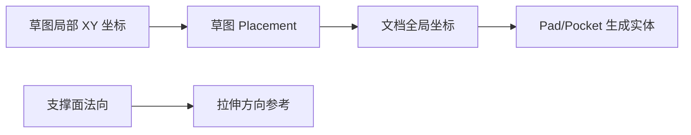

# 02-坐标和引用：草图画在哪个面上

## 一句话结论

草图不是天然在世界坐标原点上。它的位置由 `Placement`、Attachment/Support 和被引用的面共同决定。后面的 Pad、Pocket 读取草图时，也会把这些坐标关系带进去。

## 用户视角

用户新建草图时可以：

- 直接选 XY/YZ/XZ 这类基准平面。
- 先选实体上的一个面，再在这个面上建草图。
- 后续通过 Map/Attachment 把草图重新贴到别的面上。

用户看到的是“草图贴到一个平面上”，源码里是对象的放置属性和支持引用发生了变化。

## 对象视角

`App::GeoFeature` 提供 `Placement` 属性。凡是有空间位置的对象，都会通过这个属性表达自身坐标。

草图本身是 `Part::Part2DObject` 的派生对象，支持 Attachment。PartDesign 里读取草图支撑面时，走的是 `ProfileBased::getSupportFace()`：

- 如果草图有 `AttachmentSupport`，就从被支撑对象取子形状。
- 要求支撑形状是面，并且能转换成平面。
- 如果没有可用支撑，就用草图自身平面构造。

关系图：

## 几何视角

同一个矩形草图，放在不同平面上，后续 Pad 的方向和实体位置都会不同。坐标关系一般可以这样理解：

草图内部的线、圆通常在草图自己的局部平面里；真正生成三维结果时，才结合 Placement 和支撑面。

## 重算视角

草图支撑或 Placement 变化后，草图对象和依赖它的 PartDesign 特征会被重算。`FeatureSketchBased` 在取草图轮廓、取支撑面、取 UpToFace/UpToShape 时都会重新解析引用。

## 源码索引

- `src/App/GeoFeature.h`：`PropertyPlacement Placement`。
- `src/App/Placement.cpp`：放置数据结构和变换。
- `src/Mod/Sketcher/App/SketchObject.cpp`：草图执行和外部引用更新。
- `src/Mod/Part/AttachmentEditor/`：Attachment 相关界面逻辑。
- `src/Mod/PartDesign/App/FeatureSketchBased.cpp`：`ProfileBased::getSupportFace()`、`getTopoShapeSupportFace()`、`getUpToFace()`。
- `src/Mod/PartDesign/Gui/SketchWorkflow.cpp`：PartDesign 下创建/进入草图的工作流。

## 常见误区

- “草图画在面上”不是把线直接写进实体面里，而是草图对象保存了对支撑面的引用和自己的放置。
- `Placement` 不等于几何本身，它决定几何被摆到哪里。
- 支撑面必须能作为平面用；不是所有被选中的子形状都能当草图平面。

