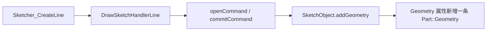
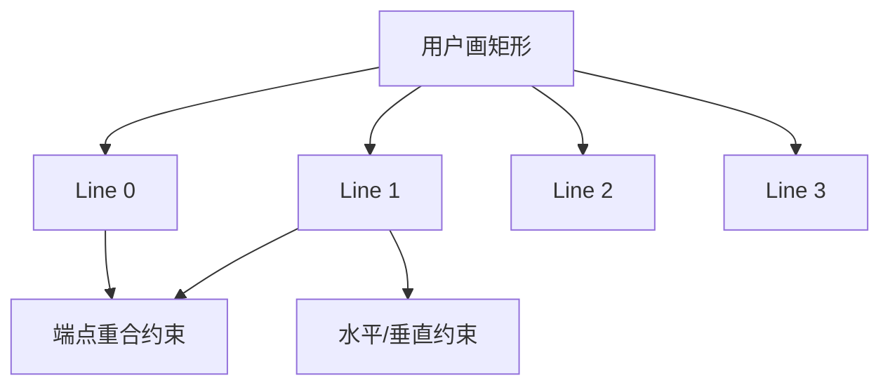

# 03-创建草图：二维几何怎么存起来

## 一句话结论

草图里的线、圆、弧不是屏幕像素，而是 `SketchObject.Geometry` 里的 `Part::Geometry` 对象。每加一个几何元素，草图都会给它一个几何编号，约束再用这个编号去引用它。

## 用户视角

用户点“新建草图”时，Sketcher 命令创建 `Sketcher::SketchObject`。用户点“线段”“矩形”“圆”时，GUI 命令进入绘制处理器，最后通过 Python 命令或对象接口调用 `addGeometry()`。

以画线为例，用户看到的是拖一条线；源码里是：

## 对象视角

`SketchObject` 里和几何直接相关的属性是：

- `Geometry`：普通草图几何。
- `Constraints`：约束列表。
- `ExternalGeometry`：链接到外部对象的子形状引用。
- `ExternalGeo`：重建出来的外部几何缓存。
- `InternalShape`：草图内部形状缓存。
- `Shape`：对外输出的草图形状。

`addGeometry()` 有多个重载，可以加入单个几何，也可以加入一组几何。加入后，几何会在 `Geometry` 列表里占位置，后续约束用 `GeoId` 指向它。

## 几何视角

一个矩形不是“矩形对象”，通常是四条线，再配上重合、水平、垂直等约束。

这就是为什么草图可以被尺寸驱动：几何只是初始形状，约束才决定它最终应该在哪里。

## 重算视角

添加或删除几何后，草图会被触发求解。`SketchObject::execute()` 最后会调用 `buildShape()`，把求解后的二维几何转成 `Shape`。

## 源码索引

- `src/Mod/Sketcher/App/SketchObject.h`：`Geometry`、`Constraints`、`ExternalGeometry`、`InternalShape` 属性定义；`addGeometry()` 接口。
- `src/Mod/Sketcher/App/SketchObjectGeometry.cpp`：`SketchObject::addGeometry()` 实现。
- `src/Mod/Sketcher/Gui/Command.cpp`：`CmdSketcherNewSketch` 创建草图。
- `src/Mod/Sketcher/Gui/CommandCreateGeo.cpp`：各种创建几何的命令，如线、圆、矩形、样条。
- `src/Mod/Sketcher/Gui/DrawSketchHandlerLine.h`、`src/Mod/Sketcher/Gui/DrawSketchHandlerRectangle.h`：具体绘制处理器。

## 常见误区

- 草图编号不是稳定的“名字”，删除和重建几何会影响编号和引用。
- 构造线也在草图几何里，只是带 construction 状态，不直接作为实体轮廓。
- GUI 命令只是入口，真正长期保存的是 `SketchObject` 的属性。
