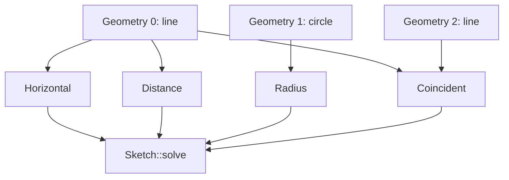

# 04-草图约束：尺寸为什么能驱动几何

## 一句话结论

尺寸能驱动几何，是因为草图保存了约束列表。每次求解时，`SketchObject::solve()` 把完整几何和约束交给 `Sketch` 求解器，求解后的几何再写回草图。

## 用户视角

用户加约束时可能点：

- 重合、水平、垂直。
- 平行、垂直、相切。
- 距离、半径、直径、角度。
- 相等、对称、锁定。

界面上是一颗约束图标，源码里是往 `Constraints` 属性加入一个 `Sketcher::Constraint`。

## 对象视角

约束对象会记录：

- 约束类型，例如 `Distance`、`Coincident`、`Horizontal`。
- 作用的几何编号。
- 作用的点位编号。
- 尺寸值或角度值。

GUI 命令里大量调用类似 `addConstraint(Sketcher.Constraint(...))` 的命令。对象层由 `SketchObject::addConstraint()` 和 `addConstraints()` 接收。

约束关系图：

## 几何视角

草图求解不是随便移动线段，而是在满足约束的前提下找一组几何位置。比如一条线有水平约束和长度约束时，求解器会让它保持水平，并把端点距离调整到指定值。

自由度可以这样理解：

## 重算视角

`SketchObject::solve()` 调用 `solvedSketch.setUpSketch(getCompleteGeometry(), Constraints.getValues(), getExternalGeometryCount())`，然后求解。`SketchObject::execute()` 会：

1. 重建外部几何。
2. 让约束接受当前完整几何。
3. 调用 `solve(true)`。
4. 调用 `buildShape()` 输出形状。

## 源码索引

- `src/Mod/Sketcher/App/Constraint.h`、`src/Mod/Sketcher/App/Constraint.cpp`：约束对象。
- `src/Mod/Sketcher/App/SketchObjectConstraints.cpp`：`solve()`、`addConstraint()`、`addConstraints()`。
- `src/Mod/Sketcher/App/Sketch.cpp`、`src/Mod/Sketcher/App/Sketch.h`：草图求解核心。
- `src/Mod/Sketcher/Gui/CommandConstraints.cpp`：约束按钮如何生成 `Sketcher.Constraint(...)`。
- `src/Mod/Sketcher/App/SketchObject.cpp`：`execute()` 调用求解和 `buildShape()`。

## 常见误区

- 尺寸不是只显示给人看的标注，它是驱动约束。
- 约束越多不一定越好，冗余或冲突会让求解状态变差。
- `solve()` 只更新草图几何；依赖草图的实体特征还要等文档重算继续执行。
