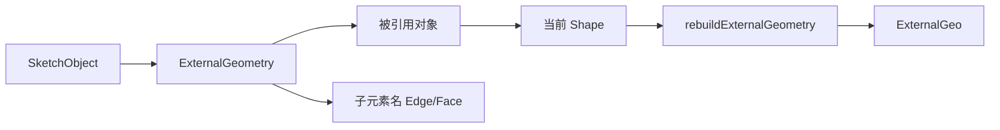

# 05-外部几何和拓扑命名：为什么能引用已有边面

## 一句话结论

草图能引用已有边面，是因为 `ExternalGeometry` 保存了“对象 + 子元素名”的链接。模型变化后，FreeCAD 会尝试通过元素映射和外部几何重建把旧引用更新到新形状上。

## 用户视角

用户在草图里点“外部几何”，再选已有实体的一条边。之后这条边会以外部参考线出现在草图里，可以被尺寸或重合约束引用。

用户看到的是一条参考边；对象里保存的是：

- 引用哪个对象。
- 引用哪个子元素，例如某个 Edge 或 Face。
- 这条外部几何当前是否 missing、detached、defining、frozen。

## 对象视角

`SketchObject` 的相关属性：

- `ExternalGeometry`：`PropertyLinkSubList`，保存外部对象和子元素名。
- `ExternalGeo`：实际重建出来的几何列表。
- `ExternalGeometryExtension`：给外部几何附加状态标记。
- `InternalShape`：草图内部形状缓存，供内部子元素引用使用。

引用链：

## 几何视角

外部几何不是复制一份死几何。普通同步状态下，它会跟着源对象的子元素更新。冻结或 detached 状态下，行为会不同，具体由 `ExternalGeometryExtension` 标记控制。

## 重算视角

外部引用变化后，`SketchObject::onExternalGeometryChanged()` 会更新引用并触发求解。`rebuildExternalGeometry()` 会读取 `ExternalGeometry` 里的对象和子元素，重新构造 `ExternalGeo`。

`updateGeometryRefs()` 负责在引用名称变化时尝试更新外部几何引用。`PropertyLinkBase` 也有元素引用更新逻辑，帮助对象间链接跟随拓扑命名变化。

## 源码索引

- `src/Mod/Sketcher/App/SketchObject.h`：`ExternalGeometry`、`ExternalGeo`、`InternalShape`。
- `src/Mod/Sketcher/App/ExternalGeometryExtension.h`：外部几何标记。
- `src/Mod/Sketcher/App/SketchObjectExternal.cpp`：`rebuildExternalGeometry()`、`updateGeometryRefs()`、`fixExternalGeometry()`。
- `src/Mod/Sketcher/App/SketchObject.cpp`：`onExternalGeometryChanged()`、`InternalShape` / `Shape` 输出顺序。
- `src/App/ElementMap.*`、`src/App/MappedName.*`：元素映射和名称。
- `src/App/PropertyLinks.cpp`：元素引用更新。

## 常见误区

- 外部几何不是普通草图线，它带着源对象引用。
- 子元素名可能因为上游特征变化而需要更新，所以拓扑命名很重要。
- 草图的 `InternalShape` 不是多余缓存，它用于内部元素引用和后续映射。

