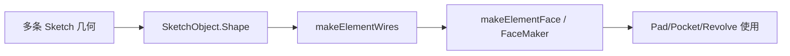
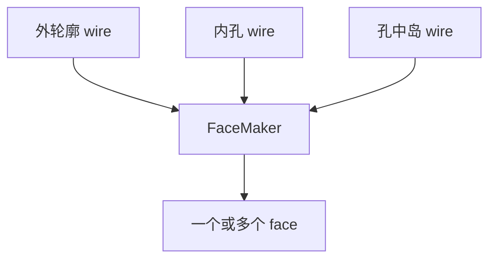

# 06-从草图到轮廓：线框怎么变成面

## 一句话结论

PartDesign 特征不能直接拿一堆散线去拉伸。它要先把草图输出整理成 wire，再把闭合 wire 变成 face。这个过程主要在 `FeatureSketchBased` 和 `TopoShape` / `FaceMaker` 里完成。

## 用户视角

用户画一个闭合矩形，再点 Pad。FreeCAD 如果能识别出闭合轮廓，就能拉伸；如果线没有闭合或轮廓有问题，就会报错或无法生成预期实体。

用户以为是“一个矩形”，源码里通常是：

## 对象视角

`ProfileBased` 是很多草图特征的共同基类。它负责从 `Profile` 链接拿到草图或其他轮廓对象，再提取轮廓形状。

关键动作：

- `getProfileShape()`：取轮廓源形状。
- `getProfileWires()`：把轮廓转成 wire。
- `getVerifiedFace()`：确保能得到可用 face。
- `getSupportFace()`：如果草图贴在面上，取支撑面。

## 几何视角

线框变面时，孔和岛也要被正确识别。FreeCAD 有多个 FaceMaker：

- `Part::FaceMakerBullseye`：支持带孔和孔中岛的平面面。
- `Part::FaceMakerCheese`：支持带孔，但不支持孔中岛。
- `Part::FaceMakerBuildFace`：通过构面算法处理边。

示意：

## 重算视角

草图重算输出 `Shape` 后，PartDesign 特征重算时再读取这个 `Shape`。如果特征要求 face，但草图只能给出散边或不能成面，`getVerifiedFace()` 会失败。

## 源码索引

- `src/Mod/PartDesign/App/FeatureSketchBased.h`：`ProfileBased` 接口。
- `src/Mod/PartDesign/App/FeatureSketchBased.cpp`：`getProfileShape()`、`getProfileWires()`、`getVerifiedFace()`、`getSupportFace()`。
- `src/Mod/Part/App/TopoShape.h`、`src/Mod/Part/App/TopoShape.cpp`：`makeElementWires()`、`makeElementFace()`。
- `src/Mod/Part/App/FaceMaker.cpp`：FaceMaker 构造和 `Build()`。
- `src/Mod/Part/App/FaceMakerBullseye.cpp`、`src/Mod/Part/App/FaceMakerCheese.cpp`、`src/Mod/Part/App/FaceMakerBuildFace.cpp`：不同构面策略。
- `src/Mod/Sketcher/App/SketchObject.cpp`：草图 `Shape` 和 `InternalShape` 输出。

## 常见误区

- Pad 失败不一定是拉伸失败，可能是草图轮廓没法变成面。
- 闭合线框、内部孔、岛结构都会影响 FaceMaker 选择和结果。
- 构造线一般不作为实体轮廓。
