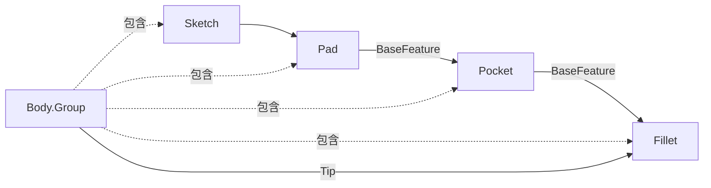

# 07-Body和特征链：实体历史怎么排队

## 一句话结论

PartDesign 的 Body 像一条加工历史线。`Group` 存放特征顺序，`BaseFeature` 指向前一个实体特征，`Tip` 指向当前最终结果。

## 用户视角

用户在 Body 里依次做 Pad、Pocket、Fillet。模型树里会出现一串对象，通常只有最后的 Tip 显示为最终实体。

用户拖动 Tip 或移动特征顺序时，本质是在改 Body 的历史链。

## 对象视角

`Body` 维护三个重点：

- `Group`：Body 里有哪些对象。
- `Tip`：当前最终特征。
- `BaseFeature`：外部基础形状或首个实体特征的来源。

`Body::addObject()` 会：

1. 检查对象是否允许放进 Body。
2. 把对象插入到合适位置。
3. 如果加入的是实体特征，就把 `Tip` 移到这个对象。
4. 给新特征设置 `BaseFeature` 为前一个实体特征。
5. 如果后面还有实体特征，把后一个特征的 `BaseFeature` 重接到新特征。

图示：

## 几何视角

Body 的最终形状不是 Group 里所有形状简单叠加，而是实体特征链一步步加工：

## 重算视角

Body 自己的 `execute()` 会检查 Tip。如果 Tip 为空或 Tip 的形状为空，就会报错。实际几何主要由各个 PartDesign 特征的 `execute()` 生成。

## 源码索引

- `src/Mod/PartDesign/App/Body.h`：`Tip`、`getPrevSolidFeature()`、`getNextSolidFeature()`。
- `src/Mod/PartDesign/App/Body.cpp`：`Body::addObject()`、`removeObject()`、`execute()`、`isAllowed()`。
- `src/Mod/PartDesign/App/Feature.h`：`PartDesign::Feature` 的 `BaseFeature`。
- `src/Mod/PartDesign/App/Feature.cpp`：`BaseFeature` 属性和 Body 插入相关逻辑。
- `src/Mod/PartDesign/Gui/CommandBody.cpp`：创建 Body、移动 Tip、移动特征的命令。

## 常见误区

- Body 里可以有草图、基准、ShapeBinder、特征，但不是每个对象都会成为实体历史节点。
- Tip 指向哪个特征，用户看到的最终实体就来自哪个特征。
- 插入中间特征时，后续特征的 `BaseFeature` 需要重接，不然历史链会断。

