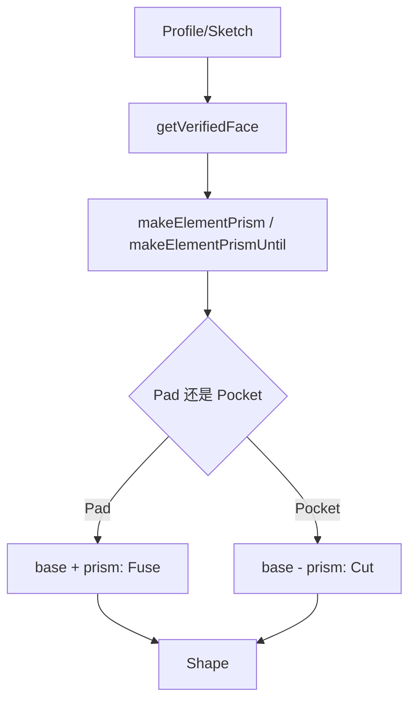

# 08-Pad和Pocket：拉伸如何变成加料减料

## 一句话结论

Pad 和 Pocket 都走 `FeatureExtrude::buildExtrusion()`。Pad 把草图轮廓拉成材料并 fuse 到旧实体；Pocket 把草图轮廓拉成刀具体并从旧实体里 cut 掉。

## 用户视角

用户设置的主要参数包括：

- 长度。
- 是否反向。
- 是否对称或双向。
- 到第一个面、到最后一个面、到指定面、到指定形状。
- 拔模角。
- 是否 refine。

界面上是参数面板，源码里是 Pad/Pocket 对象的一组属性。

## 对象视角

`Pad::execute()` 直接调用：

```text
buildExtrusion(ExtrudeOption::MakeFace | ExtrudeOption::MakeFuse)
```

`Pocket::execute()` 也调用 `buildExtrusion()`，但它的 `addSubType` 是 Subtractive。`FeatureAddSub::getAddSubShape()` 会按 Additive/Subtractive 把工具形状分到加料或减料通道。

流程：



## 几何视角

`FeatureExtrude` 先算方向，再生成 prism：

- Length/ThroughAll 走长度拉伸。
- UpToFace/UpToShape/UpToFirst/UpToLast 先找终止面或终止形状，再拉伸到那里。
- 有拔模角时走 draft 相关路径。
- 有旧实体且需要 fuse/cut 时，调用布尔操作。

## 重算视角

`FeatureExtrude::mustExecute()` 会检查 Length、Type、SideType、TaperAngle、Direction、UpToFace、UpToShape 等属性是否 touched。`buildExtrusion()` 生成结果后，会按 `Refine` 属性决定是否调用 `refineShapeIfActive()`。

## 源码索引

- `src/Mod/PartDesign/App/FeaturePad.cpp`：`Pad` 属性和 `Pad::execute()`。
- `src/Mod/PartDesign/App/FeaturePocket.cpp`：`Pocket` 属性和 `Pocket::execute()`。
- `src/Mod/PartDesign/App/FeatureExtrude.cpp`：`computeDirection()`、`buildExtrusion()`、`generateSingleExtrusionSide()`。
- `src/Mod/PartDesign/App/FeatureAddSub.cpp`：Additive/Subtractive 工具形状。
- `src/Mod/PartDesign/App/FeatureRefine.cpp`：`Refine` 属性和 `refineShapeIfActive()`。
- `src/Mod/Part/App/TopoShape.h`、`src/Mod/Part/App/TopoShape.cpp`：`makeElementPrism()`、`makeElementPrismUntil()`、`makeElementBoolean()`。
- `src/Mod/PartDesign/Gui/TaskPadParameters.cpp`、`src/Mod/PartDesign/Gui/TaskPocketParameters.cpp`：参数面板。

## 常见误区

- Pocket 不是“负长度 Pad”，它是 Subtractive 特征，最终通过 cut 修改 base。
- UpToFace/UpToShape 不是简单长度，它需要解析目标面或目标形状。
- Refine 不是建模本体，它是在结果之后清理冗余边面。
