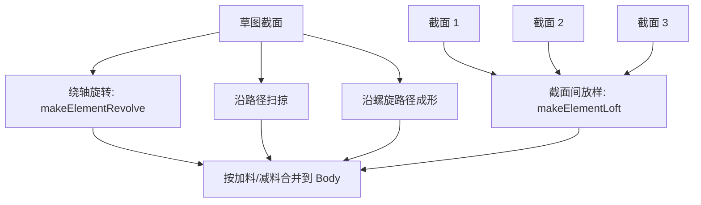

# 09-旋转扫掠放样：不只是拉伸的实体

## 一句话结论

Pad/Pocket 是沿方向拉伸，Revolution/Groove 是绕轴旋转，Pipe 是沿路径扫掠，Loft 是在多个截面之间过渡，Helix 是沿螺旋路径生成或切除。它们都还是 PartDesign 特征，结果继续接在 Body 的特征链上。

## 用户视角

用户常见操作：

- Revolution：选草图截面，再选旋转轴和角度，生成旋转体。
- Groove：类似 Revolution，但用于减料。
- Pipe：选截面，再选路径，截面沿路径走。
- Loft：选多个截面，生成过渡实体。
- Helix：生成螺旋加料或螺旋切除。

## 对象视角

这些特征都有自己的 `execute()`：

- `Revolution::execute()`：旋转加料。
- `Groove::execute()`：旋转减料。
- `Pipe::execute()`：路径扫掠。
- `Loft::execute()`：截面放样。
- `Helix::execute()`：螺旋特征。

它们大多仍继承 PartDesign 特征体系，所以输出还是写到 `Shape`，并且可以作为后续特征的 `BaseFeature`。

## 几何视角

几种生成方式的差别：

Revolved 类特征最终会调用 `TopoShape::makeElementRevolve()`。Loft 会调用 `TopoShape::makeElementLoft()`。Pipe/Helix 也走 TopoShape 和 OCCT 构形能力，只是输入从“方向向量”换成“路径/螺旋参数”。

## 重算视角

用户改轴、角度、路径、截面列表后，对应特征被 touched。文档重算时，特征重新读取草图/截面/路径，生成新 Shape，再让后面的 Body 特征继续执行。

## 源码索引

- `src/Mod/PartDesign/App/FeatureRevolution.cpp`：`Revolution::execute()`。
- `src/Mod/PartDesign/App/FeatureGroove.cpp`：`Groove::execute()`。
- `src/Mod/PartDesign/App/FeatureRevolved.cpp`：旋转特征公共逻辑，调用 `makeElementRevolve()`。
- `src/Mod/PartDesign/App/FeaturePipe.cpp`：`Pipe::execute()`。
- `src/Mod/PartDesign/App/FeatureLoft.cpp`：`Loft::execute()`，调用 `makeElementLoft()`。
- `src/Mod/PartDesign/App/FeatureHelix.cpp`：`Helix::execute()`。
- `src/Mod/Part/App/TopoShape.h`、`src/Mod/Part/App/TopoShape.cpp`：`makeElementRevolve()`、`makeElementLoft()`、pipe/offset/compound 相关几何接口。

## 常见误区

- Revolution 不是把 Pad 方向换成圆周方向，它有旋转轴和角度。
- Loft 的关键输入是多个截面，不是一个草图。
- Pipe 的关键输入是路径，路径质量会直接影响结果。
