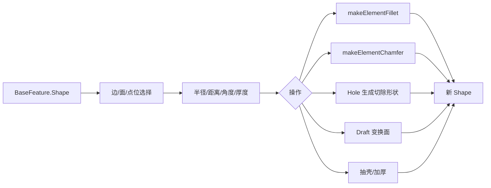

# 10-孔倒角圆角厚度：实体后处理怎么做

## 一句话结论

Hole、Fillet、Chamfer、Draft、Thickness 都是在已有实体上继续加工。它们通常先拿到 `BaseFeature` 的形状，再根据用户选择的边、面或孔参数生成新的实体结果。

## 用户视角

用户通常已经有一个实体，然后：

- Hole：在草图点位或选定位置打孔。
- Fillet：选边，设置半径。
- Chamfer：选边，设置倒角距离或参数。
- Draft：选面，设置拔模方向和角度。
- Thickness：选要开口的面，给实体加厚或抽壳。

这些操作看起来是在旧实体上“编辑”，源码里还是生成一个新的特征对象。

## 对象视角

每个后处理特征都有自己的输入属性：

- 被选中的边/面。
- 半径、距离、角度、厚度等参数。
- `BaseFeature` 指向前一个实体特征。

输出仍然是当前特征的 `Shape`。Body 的 `Tip` 如果指向它，用户看到的就是加工后的最终实体。

## 几何视角

Fillet/Chamfer 明确调用 TopoShape 的圆角/倒角接口。Hole 的实现更长，因为它要处理孔型、孔深、螺纹、沉头/沉孔等参数。Thickness 会按选面和厚度生成壳/加厚结果。

## 重算视角

当选边、选面或参数变化时，后处理特征 touched。重算时会重新读取 base shape 和选择列表。如果上游实体拓扑变了，选中的 Edge/Face 名称可能需要通过拓扑命名更新，否则后处理可能找不到原来的边面。

## 源码索引

- `src/Mod/PartDesign/App/FeatureHole.cpp`：`Hole::execute()` 和孔参数处理。
- `src/Mod/PartDesign/App/FeatureFillet.cpp`：`Fillet::execute()`，调用 `makeElementFillet()`。
- `src/Mod/PartDesign/App/FeatureChamfer.cpp`：`Chamfer::execute()`，调用 `makeElementChamfer()`。
- `src/Mod/PartDesign/App/FeatureDraft.cpp`：`Draft::execute()`。
- `src/Mod/PartDesign/App/FeatureThickness.cpp`：`Thickness::execute()`。
- `src/Mod/Part/App/TopoShape.h`、`src/Mod/Part/App/TopoShape.cpp`：圆角、倒角、offset/thickness 等底层接口。
- `src/Mod/PartDesign/PartDesignTests/TestFillet.py`、`src/Mod/PartDesign/PartDesignTests/TestChamfer.py`、`src/Mod/PartDesign/PartDesignTests/TestHole.py`、`src/Mod/PartDesign/PartDesignTests/TestThickness.py`：测试用例。

## 常见误区

- 圆角和倒角依赖边名；上游变动可能让边引用变化。
- Hole 不是普通 Pocket 的简单别名，它有孔标准、沉孔、螺纹等专门参数。
- Thickness 不是单纯缩放实体，它会处理面删除、offset 和壳体结果。
