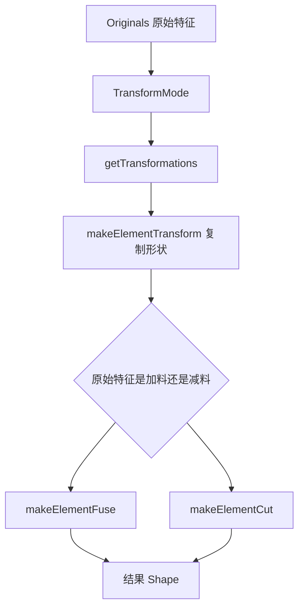

# 11-阵列镜像多变换：一个特征怎么复制成多个

## 一句话结论

镜像、线性阵列、极轴阵列、缩放、多重变换的核心是生成一组 `gp_Trsf` 变换矩阵，然后把原始特征的加料/减料工具形状复制到多个位置，再 fuse 或 cut 回支撑实体。

## 用户视角

用户通常先做一个孔、凸台或切口，再选择：

- Mirror：按平面/轴镜像。
- LinearPattern：沿方向复制若干个。
- PolarPattern：绕轴旋转复制若干个。
- Scaled：按比例复制。
- MultiTransform：把多个变换串起来。

## 对象视角

公共基类是 `PartDesign::Transformed`。它有 `Originals` 属性，保存被变换的原始特征。子类实现 `getTransformations()`，返回一组变换。

执行逻辑：

## 几何视角

`FeatureTransformed::execute()` 有两类处理：

- WholeShape 模式：对整个支撑形状做变换，生成多个形状再 fuse。
- 对特征变换：逐个取原始特征的 add/sub 工具形状，变换后对支撑形状 fuse/cut。

子类提供不同变换：

- `Mirrored::getTransformations()`：原形 + 镜像。
- `LinearPattern::getTransformations()`：沿方向的多次平移。
- `PolarPattern::getTransformations()`：绕轴的多次旋转。
- `Scaled::getTransformations()`：比例缩放。
- `MultiTransform::getTransformations()`：把多个变换特征组合起来。

## 重算视角

原始特征、变换数量、方向、轴、模式变化都会触发重算。重算时不会只移动显示对象，而是重新构造变换后的几何结果。

## 源码索引

- `src/Mod/PartDesign/App/FeatureTransformed.cpp`：`Transformed::execute()`、`Originals`、`TransformMode`。
- `src/Mod/PartDesign/App/FeatureMirrored.cpp`：`Mirrored::getTransformations()`。
- `src/Mod/PartDesign/App/FeatureLinearPattern.cpp`：`LinearPattern::getTransformations()`。
- `src/Mod/PartDesign/App/FeaturePolarPattern.cpp`：`PolarPattern::getTransformations()`。
- `src/Mod/PartDesign/App/FeatureScaled.cpp`：`Scaled::getTransformations()`。
- `src/Mod/PartDesign/App/FeatureMultiTransform.cpp`：组合多组变换。
- `src/Mod/PartDesign/PartDesignTests/TestMirrored.py`、`src/Mod/PartDesign/PartDesignTests/TestLinearPattern.py`、`src/Mod/PartDesign/PartDesignTests/TestPolarPattern.py`、`src/Mod/PartDesign/PartDesignTests/TestMultiTransform.py`。

## 常见误区

- 阵列不是在树里复制很多独立特征，而是一个变换特征生成多个几何实例。
- 原始特征是加料还是减料会影响最终是 fuse 还是 cut。
- MultiTransform 不是简单列表显示，它会组合多个子变换的结果。
