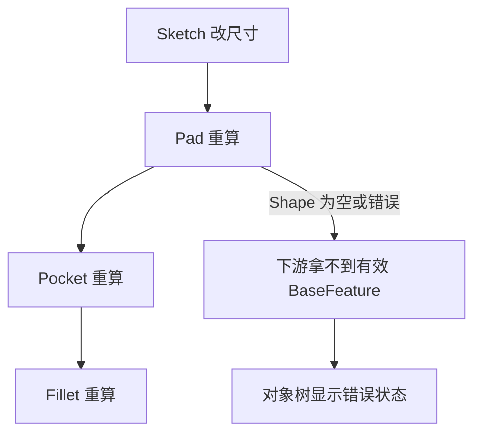

# 13-重算和错误恢复：改了尺寸以后谁重新执行

## 一句话结论

改尺寸后，FreeCAD 先标记对象 touched，再由 `Document::recompute()` 按依赖顺序执行对象。执行失败会记录到对象状态，后续对象可能拿不到有效 Shape。

## 用户视角

用户把草图长度从 20 改成 30，实体跟着变长。背后不是只改显示尺寸，而是：

1. 约束值变化。
2. Sketch 被重算。
3. Pad 读取新的 Sketch.Shape，重新拉伸。
4. Pocket/Fillet/Pattern 继续基于新的上游 Shape 重算。
5. 如果某一步找不到边、面或生成空 Shape，树上会显示错误。

## 对象视角

对象重算状态来自 `DocumentObject`：

- `touch()`：标记对象需要重算。
- `mustExecute()`：判断对象是否必须执行。
- `recompute()`：通用重算入口。
- `execute()`：子类真正生成结果。

属性链接维护依赖，所以草图变了，依赖草图的 Pad 会进入重算路径。

## 几何视角

几何失败常见原因：

- 草图不能形成有效 face。
- UpToFace/UpToShape 引用失效。
- Fillet/Chamfer 找不到原来的边。
- Boolean fuse/cut 结果为空。
- Refine 失败。

错误传播图：

## 重算视角

`Document::recompute()` 会使用依赖关系安排执行顺序，单个对象通过 `_recomputeFeature()` 调用对象的 `recompute()`。表达式引擎也会在对象重算前后执行。

PartDesign 还有 refine 逻辑。`FeatureRefine::refineShapeIfActive()` 在 `Refine` 打开时调用 `TopoShape::makeElementRefine()`。底层 refine 使用 `Part::BRepBuilderAPI_RefineModel`，它会构建结果并记录修改/删除关系。

## 源码索引

- `src/App/Document.cpp`：`Document::recompute()`、`Document::_recomputeFeature()`。
- `src/App/DocumentObject.cpp`：`touch()`、`mustExecute()`、`recompute()`、`execute()`。
- `src/App/PropertyLinks.cpp`：链接属性和依赖维护。
- `src/Mod/Sketcher/App/SketchObject.cpp`：草图重算、`buildShape()`。
- `src/Mod/PartDesign/App/FeatureRefine.cpp`：`Refine` 属性、`refineShapeIfActive()`。
- `src/Mod/Part/App/TopoShape.cpp`：`makeRefine()`。
- `src/Mod/Part/App/modelRefine.cpp`：`BRepBuilderAPI_RefineModel`。

## 常见误区

- 重算失败不一定发生在刚改的对象，可能是下游特征引用失效。
- Refine 是结果清理，不应该被理解为修复所有建模错误。
- 文档重算依赖对象链接；没有正确链接的对象不会天然知道谁依赖谁。

