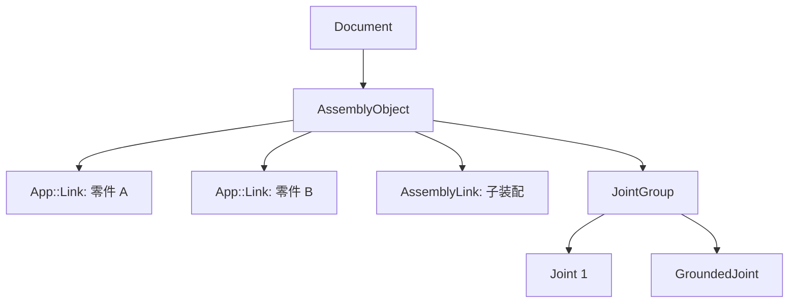

# 14-装配体基础：零件如何放进 Assembly

## 一句话结论

Assembly 不是把所有零件几何合成一个大实体。它用 `AssemblyObject` 做容器，用 `App::Link` 或 `AssemblyLink` 引用组件，再通过 Placement 和 Joint 管理它们的位置。

## 用户视角

用户创建装配体后，会把已有零件插入装配。树上会出现组件引用。组件可以被移动、固定、加入关节，也可以包含子装配。

## 对象视角

主要对象：

- `Assembly::AssemblyObject`：装配体本体，继承自 `App::Part`。
- `Assembly::AssemblyLink`：引用另一个装配或子装配。
- `App::Link`：引用普通零件对象。
- `JointGroup`：装配中的关节集合。
- `ViewGroup`、`BomGroup`、`SimulationGroup`：视图、BOM、仿真相关分组。

对象关系：

## 几何视角

组件本身保留自己的 Shape。装配层主要改变组件的 `Placement`，而不是把所有实体布尔合并。

`AssemblyLink::updateContents()` 会同步被链接装配的组件。Rigid 模式下，子装配表现为一个整体；Flexible 模式下，子装配内部组件可以参与父装配求解。

## 重算视角

`AssemblyLink::execute()` 会调用 `updateContents()`，里面同步组件和关节。`AssemblyObject` 的核心不是普通几何 `execute()`，而是 `solve()`：根据关节求解并更新组件 Placement。

## 源码索引

- `src/Mod/Assembly/App/AssemblyObject.h`、`src/Mod/Assembly/App/AssemblyObject.cpp`：装配体对象、组件和关节管理。
- `src/Mod/Assembly/App/AssemblyLink.h`、`src/Mod/Assembly/App/AssemblyLink.cpp`：`LinkedObject`、`Rigid`、`updateContents()`、`synchronizeComponents()`、`synchronizeJoints()`。
- `src/Mod/Assembly/App/JointGroup.h`、`src/Mod/Assembly/App/JointGroup.cpp`：关节分组。
- `src/Mod/Assembly/Gui/ViewProviderAssembly.cpp`：装配视图交互和 solve 触发。
- `src/Mod/Assembly/AssemblyTests/TestCore.py`、`src/Mod/Assembly/AssemblyTests/TestCommandInsertLink.py`：装配测试入口。

## 常见误区

- Assembly 里的组件通常是引用，不是复制出来的独立实体。
- Placement 是装配定位的核心数据。
- 子装配 Rigid/Flexible 会影响父装配如何看待它。
