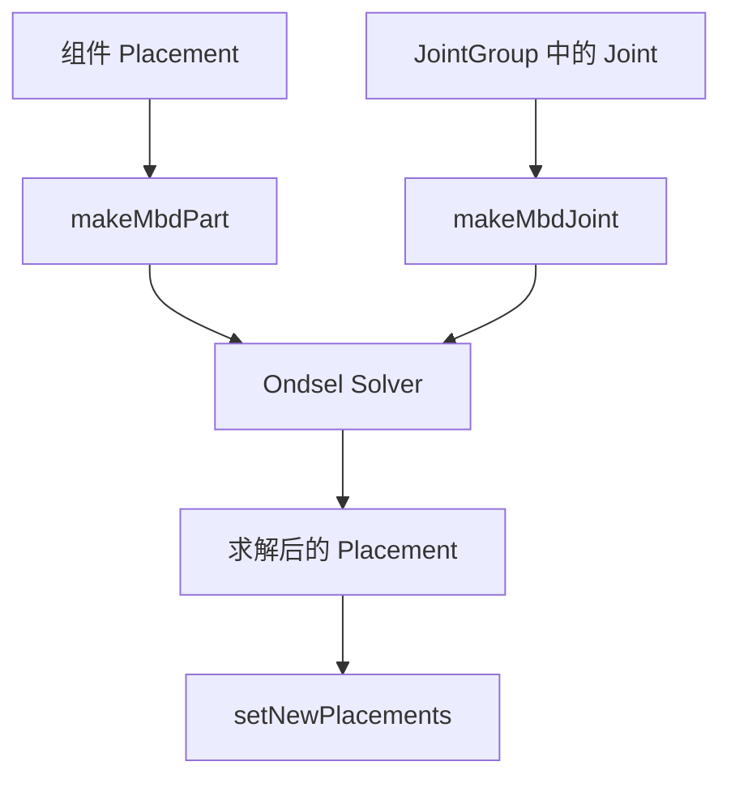

# 15-关节和求解：装配约束怎么移动零件

## 一句话结论

装配关节不是直接把两个零件焊死。FreeCAD 会把 Joint 转成 Ondsel Solver 的部件、标记和关节对象，求解后再把新 Placement 写回组件。

## 用户视角

用户选择两个组件上的面、边、轴或点，再创建关节：

- Fixed：固定。
- Revolute：转动。
- Slider：滑动。
- Cylindrical：转动加滑动。
- Ball：球铰。
- Distance/Angle/Parallel/Perpendicular 等：距离或方向关系。

如果约束冲突、冗余或格式不对，界面会提供选择冲突/冗余/错误约束的命令。

## 对象视角

`AssemblyObject::solve()` 是主入口。它会：

1. 确保 LinkGroup 或子装配的 Placement 处于合适状态。
2. 同步 grounded joints。
3. 收集 joints。
4. 保存旧 Placement 以便 undo。
5. 创建求解器系统。
6. 把组件变成 MbD part。
7. 把 Joint 变成 MbD joint。
8. 求解。
9. 校验新位置。
10. 把新 Placement 写回对象。

求解图：

## 几何视角

Joint 本身引用组件上的子元素。`AssemblyObject::handleOneSideOfJoint()` 会根据 Joint 的 `Reference1/Reference2` 和 `Placement1/Placement2` 计算标记位置。求解器处理的是这些标记和组件刚体之间的关系。

## 重算视角

用户拖动组件或改 Joint 后，装配求解会更新 Placement。`ViewProviderAssembly` 中有交互代码会调用 `assembly->solve()`，并重画 Joint 位置。

`AssemblyObject` 还记录：

- `lastSolverStatus`
- 冲突关节
- 冗余关节
- malformed joints

这些状态用于界面提示和选择命令。

## 源码索引

- `src/Mod/Assembly/App/AssemblyObject.cpp`：`solve()`、`makeMbdPart()`、`makeMbdJoint()`、`makeMbdJointOfType()`、`setNewPlacements()`、`validateNewPlacements()`。
- `src/Mod/Assembly/App/AssemblyObject.h`：Joint 状态、求解接口、last solver 状态。
- `src/Mod/Assembly/App/JointGroup.cpp`：`getJoints()`。
- `src/Mod/Assembly/Gui/ViewProviderAssembly.cpp`：拖动、调用 `solve()`、重画 Joint。
- `src/Mod/Assembly/Gui/Commands.cpp`：选择冲突、冗余、malformed 关节的命令。
- `src/Mod/Assembly/AssemblyTests/TestCore.py`：创建 Joint、GroundedJoint、调用 recompute 的测试。

## 常见误区

- Joint 约束的是组件之间的相对运动关系，不一定完全锁死。
- 求解器更新的是 Placement，不是重新生成零件 Shape。
- 冲突和冗余是求解关系问题，不一定是零件几何坏了。

