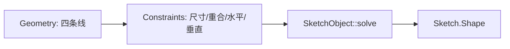
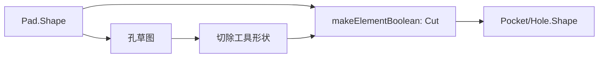
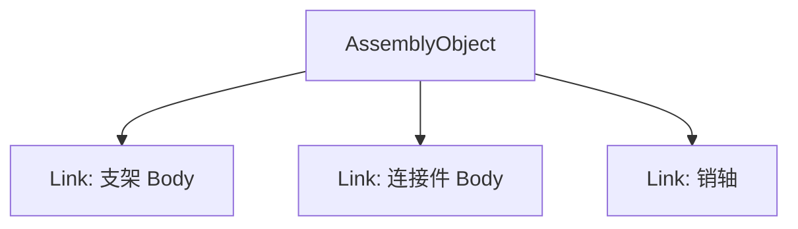
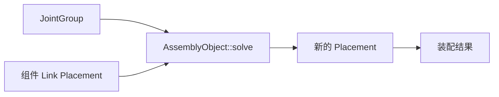

# 16-完整案例：从支架草图到小装配

## 一句话结论

完整建模就是把前面的链路连起来：Document 里建 Body，Body 里用 Sketch 和 PartDesign 特征做零件，再用 Assembly 的 Link 和 Joint 把零件装起来。

## 案例目标

做一个小支架装配：

- 零件 A：一块支架板，有安装孔、圆角和阵列孔。
- 零件 B：一根连接块或销轴座，有孔或旋转截面。
- 销轴：简单圆柱体。
- 装配：支架固定，连接块通过转动或距离关节定位。

这个案例对应源码中的真实对象类型，不引入计划外模块。

## 步骤 1：新建文档和 Body

用户操作：新建文档，创建 Body。

对象结果：

- `App::Document` 创建。
- `PartDesign::Body` 加入文档。
- 后续草图和特征加入 Body 的 `Group`。

源码入口：

- `src/App/Document.cpp`
- `src/Mod/PartDesign/App/Body.cpp`
- `src/Mod/PartDesign/Gui/CommandBody.cpp`

## 步骤 2：画支架底板草图

用户操作：新建 Sketch，画矩形，添加尺寸约束。

对象结果：

- `Sketcher::SketchObject.Geometry` 增加线段。
- `Sketcher::SketchObject.Constraints` 增加距离、水平、垂直、重合等约束。
- 草图求解后输出 `Shape`。

源码入口：

- `src/Mod/Sketcher/App/SketchObjectGeometry.cpp`
- `src/Mod/Sketcher/App/SketchObjectConstraints.cpp`
- `src/Mod/Sketcher/App/SketchObject.cpp`
- `src/Mod/Sketcher/Gui/CommandCreateGeo.cpp`
- `src/Mod/Sketcher/Gui/CommandConstraints.cpp`

## 步骤 3：Pad 成底板实体

用户操作：选择草图，点 Pad，设置厚度。

对象结果：

- 新建 `PartDesign::Pad`。
- `Pad.Profile` 指向草图。
- `Pad::execute()` 调用 `FeatureExtrude::buildExtrusion()`。
- 轮廓变 face，再拉伸成 solid。
- Body 的 `Tip` 指向 Pad。

源码入口：

- `src/Mod/PartDesign/App/FeaturePad.cpp`
- `src/Mod/PartDesign/App/FeatureExtrude.cpp`
- `src/Mod/PartDesign/App/FeatureSketchBased.cpp`
- `src/Mod/PartDesign/App/Body.cpp`

## 步骤 4：Pocket 或 Hole 打孔

用户操作：在底板面上建草图，画孔位，再 Pocket；或者使用 Hole 特征。

对象结果：

- 新草图引用底板面作为支撑。
- Pocket/Hole 读取上一个实体作为 `BaseFeature`。
- 减料结果写入新特征 `Shape`。
- Body 的 `Tip` 更新到 Pocket/Hole。

源码入口：

- `src/Mod/PartDesign/App/FeaturePocket.cpp`
- `src/Mod/PartDesign/App/FeatureHole.cpp`
- `src/Mod/PartDesign/App/FeatureExtrude.cpp`
- `src/Mod/PartDesign/App/FeatureSketchBased.cpp`

## 步骤 5：圆角和阵列

用户操作：选边做 Fillet；选一个孔或切口做 LinearPattern。

对象结果：

- Fillet 读取 base shape 和边引用，调用圆角构形。
- LinearPattern 读取原始特征，生成多组变换，把工具形状复制并 cut/fuse。

源码入口：

- `src/Mod/PartDesign/App/FeatureFillet.cpp`
- `src/Mod/PartDesign/App/FeatureLinearPattern.cpp`
- `src/Mod/PartDesign/App/FeatureTransformed.cpp`

## 步骤 6：创建连接件和销轴

用户操作：再建一个 Body，用 Pad/Pocket 或 Revolution 做连接件；销轴可以用 AdditiveCylinder 或旋转草图做。

对象结果：

- 每个零件都有自己的 Body 和 Tip。
- 每个零件的建模历史独立。

源码入口：

- `src/Mod/PartDesign/App/FeaturePrimitive.cpp`
- `src/Mod/PartDesign/App/FeatureRevolution.cpp`
- `src/Mod/PartDesign/App/FeatureRevolved.cpp`
- `src/Mod/PartDesign/PartDesignTests/TestPrimitive.py`
- `src/Mod/PartDesign/PartDesignTests/TestRevolve.py`

## 步骤 7：放入 Assembly

用户操作：创建 Assembly，把支架、连接件、销轴插入装配。

对象结果：

- 创建 `Assembly::AssemblyObject`。
- 零件通过 `App::Link` 或 `AssemblyLink` 进入装配。
- 组件位置由 `Placement` 表示。

源码入口：

- `src/Mod/Assembly/App/AssemblyObject.cpp`
- `src/Mod/Assembly/App/AssemblyLink.cpp`
- `src/Mod/Assembly/AssemblyTests/TestCommandInsertLink.py`

## 步骤 8：添加 Joint 并求解

用户操作：固定支架，给连接件和销轴添加转动、距离或同轴关系，执行装配求解。

对象结果：

- Joint 存进 `JointGroup`。
- `AssemblyObject::solve()` 把组件和 Joint 转成求解器数据。
- 求解后写回组件 Placement。

源码入口：

- `src/Mod/Assembly/App/AssemblyObject.cpp`
- `src/Mod/Assembly/App/JointGroup.cpp`
- `src/Mod/Assembly/Gui/ViewProviderAssembly.cpp`
- `src/Mod/Assembly/AssemblyTests/TestCore.py`

## 可对照的仓库素材

- `data/examples/PartDesignExample.FCStd`
- `data/examples/AssemblyExample.FCStd`
- `data/tests/PadTest.fcstd`
- `data/tests/PocketTest.fcstd`
- `src/Mod/Sketcher/SketcherTests/`
- `src/Mod/PartDesign/PartDesignTests/`
- `src/Mod/Assembly/AssemblyTests/`

## 最终理解

完整建模链路可以压缩成一句话：

这就是 FreeCAD 从草图到实体再到装配的主线。

## 源码索引

- `src/App/Document.cpp`：文档对象创建和重算入口。
- `src/Mod/Sketcher/App/SketchObject.cpp`、`src/Mod/Sketcher/App/SketchObjectGeometry.cpp`、`src/Mod/Sketcher/App/SketchObjectConstraints.cpp`：草图几何、约束、求解和 Shape 输出。
- `src/Mod/PartDesign/App/Body.cpp`：Body 的 Group、Tip、BaseFeature 链。
- `src/Mod/PartDesign/App/FeaturePad.cpp`、`src/Mod/PartDesign/App/FeaturePocket.cpp`、`src/Mod/PartDesign/App/FeatureExtrude.cpp`：Pad/Pocket 主线。
- `src/Mod/PartDesign/App/FeatureHole.cpp`、`src/Mod/PartDesign/App/FeatureFillet.cpp`、`src/Mod/PartDesign/App/FeatureLinearPattern.cpp`、`src/Mod/PartDesign/App/FeatureTransformed.cpp`：孔、圆角和阵列。
- `src/Mod/Assembly/App/AssemblyObject.cpp`、`src/Mod/Assembly/App/AssemblyLink.cpp`、`src/Mod/Assembly/App/JointGroup.cpp`：装配、链接和关节求解。
