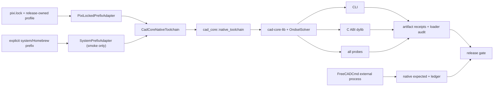

# CAD Core 统一 OCCT 与 C++ 运行时工具链重构方案

## 结论

本重构属于中高难度，但难点集中在构建、链接、装载、封装和验收 seam，不在 CAD Core 的建模语义。推荐目标是：

> CAD Core 从一份冻结的工具链收据重建自有 prefix；编译器、sysroot、OCCT headers、OCCT dylibs、C++ runtime、zstd 等 native dependency 和装载策略全部由同一个 `CadCoreNativeToolchain` 深 module 管理。FreeCADCmd 只作为独立 oracle 进程运行，绝不再向 CAD Core 进程注入 FreeCAD.app 的 LibPack dylib。

首版固定当前 oracle 使用的 OCCT 7.8.1，不同时升级内核。当前仓库根 `pixi.lock` 已包含与本机 FreeCAD.app 完全相同的 macOS arm64 OCCT 和 libc++ package identity，可以作为第一版 `release-owned` profile 的来源：

- OCCT：`7.8.1-all_h869bdd7_203`，package SHA-256 为 `0615e7a63fa4b671057bf72c9b0eb42527a2853fe15338eea76bbb36dc0201d5`。
- libc++：`21.1.8-hf598326_0`，package SHA-256 为 `82e228975fd491bcf1071ecd0a6ec2a0fcc5f57eb0bd1d52cb13a18d57c67786`。
- compiler/toolchain：根 `pixi.lock` 已锁定 macOS arm64 的 clang/clangxx 18.1.8、compiler-rt 18.1.8 和 libcxx-devel 18.1.8。

因此不需要继续把 `/Applications/FreeCAD.app/Contents/Resources/lib` 放进 CAD Core 的 RPATH。应从同一 lock/recipe 物化一个完整 SDK，再让 CAD Core 自己拥有、校验和封装其运行时闭包。

当前 `ReferenceShadow.brep` 的 filename-based `BRepTools::Read()` 修复应永久保留。统一工具链消除根因，不等于重新允许跨外部 ABI seam 传递 `std::istream`、locale 或其他 STL ownership。

## 当前 live 基线

本方案以 2026-07-11 的 live tree、CMake cache、Mach-O load commands 和实际 dyld image graph 为基线，不从 fixture 输出倒推环境结论。

| 层 | 当前实际来源 | 问题 |
| --- | --- | --- |
| 编译器 | `/usr/bin/c++` | 不属于 FreeCAD conda/LibPack toolchain。 |
| OCCT headers | `/opt/homebrew/include/opencascade` | 与实际加载的 OCCT dylib 不属于同一 prefix。 |
| OCCT dylibs | `/Applications/FreeCAD.app/Contents/Resources/lib` | 由 `CAD_CORE_OCCT_LIBRARY_ROOT` 和绝对 build RPATH 注入。 |
| C++ runtime | system libc++ + FreeCAD bundle libc++ | 同进程实际同时加载两套 libc++。 |
| zstd | Homebrew + FreeCAD bundle | 同进程实际同时加载两个 zstd image。 |
| deployment target | CAD Core CLI `minos 26.0`；FreeCAD OCCT `minos 11.0` | 编译/SDK/deployment target 未被同一 profile 固定。 |
| target 一致性 | CLI、FFI、C3M1/BREP probe 解析 FreeCAD OCCT；现有 C6M3 probe 仍带 Homebrew OCCT 绝对 load command | 一个 CMakeCache 或一个成功 CLI 不能证明所有产物闭包一致。 |

实际 `DYLD_PRINT_LIBRARIES=1` 已同时看到：

- `/usr/lib/libc++.1.dylib`；
- `/Applications/FreeCAD.app/Contents/Resources/lib/libc++.1.0.dylib`；
- `/opt/homebrew/Cellar/zstd/.../libzstd.1.5.7.dylib`；
- `/Applications/FreeCAD.app/Contents/Resources/lib/libzstd.1.5.7.dylib`。

FreeCAD bundle 的 `libTKernel.7.8.1.dylib` 使用 `@loader_path/` RPATH，并依赖 `@rpath/libc++.1.dylib`，所以它会主动解析 bundle 自带 libc++。这说明当前 BREP abort 不是“OCCT 都是 7.8.1，所以环境已经一致”，而是版本号相同、C++ ABI 与 loader closure 仍不一致。

FreeCAD.app 本身也不是完整 SDK：当前 bundle 有 OCCT/libc++ runtime 和 `conda-meta`，但没有 OCCT include tree，也没有可直接用于 CAD Core 的 clangxx。仅从 app 取 dylib、再从 Homebrew 取 headers/compiler，必然回到当前混合状态。

## “同一套工具链”的精确定义

本方案中的“同一套工具链”不是“OCCT major/minor 相同”，而是以下证据同时闭合：

1. 编译器、target triple、sysroot、SDK 和 deployment target 来自同一 profile。
2. `Standard_Version.hxx`、全部 OCCT link libraries 和它们的递归 native dependency 来自同一受控 prefix。
3. OCCT version、package build、package SHA-256 和 architecture 与冻结收据相同。
4. CAD Core、OndselSolver、CLI、FFI 和所有 probe 使用同一编译器与同一 C++ runtime family。
5. stage/install tree 使用相对 RPATH，不依赖 FreeCAD.app、Homebrew 绝对路径或 `DYLD_LIBRARY_PATH`。
6. 每个可交付产物都有静态 closure 和实际加载 closure 收据；两者一致且只出现一套受控 libc++/libc++abi。
7. 用于 native parity 的 FreeCADCmd oracle 与 CAD Core profile 至少在 OCCT/libc++ package identity 上可交叉验证；二者仍在不同进程中运行。

第 7 条表示“同源基线”，不表示 CAD Core 要链接 FreeCAD。FreeCADCmd 是语义 authority，CAD Core native toolchain 是构建和运行 authority，两条证据链在 release gate 汇合，但不共享进程。

## Design it twice：候选方案与裁决

### 方案 A：继续直接加载 FreeCAD.app LibPack

做法是保留 `CAD_CORE_OCCT_LIBRARY_ROOT`，补更多 RPATH、`DYLD_LIBRARY_PATH` 或 install-name 修正。

优点是表面上最接近 oracle 的 OCCT runtime。缺点是 FreeCAD.app 是裁剪后的应用 runtime，不是完整 SDK；headers、compiler、sysroot 和其他依赖仍要从别处拼接，而且 FFI 宿主很容易再带入另一套 C++ runtime。

裁决：拒绝作为 release 方案。只允许作为迁移期 `legacy-characterization`，用于证明旧闭包为什么不合格。

### 方案 B：只引入一个 OCCT imported target

做法是让 `cad-core-lib` 只链接 `cad_core::occt`，把 include/library 列表集中起来。

这个 interface 比当前变量拼接好，但仍太浅：CMake compiler 在 `project()` 时已经确定，普通 imported target 无法事后统一 compiler、sysroot 或 deployment target；RPATH 也不会自然通过 interface target 传递给所有 executable/shared library；更无法证明每个成品实际解析了同一闭包。

裁决：保留“单一 link target”作为调用 interface，但不能把它当完整方案。

### 方案 C：profile + 单一 link target + artifact receipt

做法是用 configure-time toolchain file 选择 compiler/sysroot，用 `cad_core::native_toolchain` 隐藏 OCCT/native dependency，用 artifact registry 统一 stage/RPATH，并为每个产物生成可验证收据。

裁决：采用。它把复杂性藏进一个有 depth 的 module：caller 只看到一个 link target 和一个 runtime-artifact 注册函数；版本、prefix、loader、closure、manifest 和 packaging 判断保持 locality。CLI、FFI、probe 和后续新 target 都获得同一份 leverage。

### 方案 D：全部改成 CAD Core 子进程

独立 worker 进程可以彻底隔离未知 FFI host 的 C++ runtime，但会改变部署、延迟和调用模型。

裁决：不作为本轮默认架构。保留为 FFI 宿主无法统一 process-wide runtime 时的正式 fallback；不能用环境变量在同一进程里猜动态库。

## 目标深 module 与 interface

### `CadCoreNativeToolchain`

module 负责：

- 在 `project()` 前固定 compiler、target triple、sysroot、SDK 和 deployment target；
- 解析并验证冻结 profile；
- 创建唯一 `cad_core::native_toolchain` target；
- 隐藏 OCCT headers、TK library 集、zstd 和 C++ runtime identity；
- 注册 CLI、FFI、OndselSolver 和 probes；
- 生成 stage/install layout、相对 RPATH 和 install name；
- 生成 toolchain manifest 与 artifact-specific closure receipt；
- 执行静态 Mach-O closure 和真实 dyld image graph 审计；
- 对 release profile fail closed。

调用 interface 保持为：

```cmake
include(cmake/CadCoreNativeToolchain.cmake)

target_link_libraries(cad-core-lib
  PUBLIC
    cad_core::native_toolchain
    OndselSolver
)

cad_core_register_runtime_artifact(TARGET cad-core KIND cli)
cad_core_register_runtime_artifact(TARGET cad_core_ffi KIND ffi)
cad_core_register_runtime_artifact(TARGET cad-core-brep-snapshot-probe KIND probe)
```

`cad_core_register_runtime_artifact()` 只登记产物类型；caller 不传 RPATH、OCCT root、libc++ path 或允许目录。module 在最后统一生成 `cad-core-artifacts` 和 `cad-core-toolchain-audit` targets。



### 实际 adapters

| Adapter | 用途 | release eligibility |
| --- | --- | --- |
| `PixiLockedPrefixAdapter` | 从冻结 lock 物化完整 compiler/OCCT/libc++ prefix | 唯一正式 release/parity profile。 |
| `SystemPrefixAdapter` | 显式指定一个完整 Homebrew/system prefix 做兼容性 smoke | 永远不能宣称 native parity green。 |
| `LegacyCharacterizationAdapter` | 迁移期读取当前 split headers/library/RPATH，稳定报告红灯 | 临时；S7 删除。 |

FreeCADCmd 不实现 `CadCoreNativeToolchain` adapter。它属于单独的 `FreeCadOracleProfile` seam，只提供 executable/provenance/collector 调用，不产生 `cad_core::native_toolchain`。

### Pixi/lock 决策

CAD Core 仍位于当前 FreeCAD monorepo 时，优先在根 `pixi.toml` 中增加最小 `cad-core` named environment，并继续使用唯一根 `pixi.lock`。这样 full FreeCAD 和 CAD Core 的 package provenance 不会被两份 lock 悄悄分叉。

`cad-core` named environment 只包含 CMake/Ninja、clangxx/compiler-rt、libcxx/libcxx-devel、OCCT 7.8.1、zstd 和 nlohmann_json 等必要项；不要求安装完整 Qt/FreeCAD 开发环境。release profile 对 package build 和 SHA-256 再做一次显式校验，不能只依赖宽版本约束。

只有将来 CAD Core 真正拆出本仓库时，才从同一 profile 导出自包含 lock；届时必须用交叉审计证明它与 oracle lock receipt 没有漂移。当前阶段不维护第二份手工同步的 lock。

## Manifest 与 artifact receipt

配置期生成：

```text
cad-core/build-owned/toolchain/cad-core-native-toolchain.v1.json
```

它至少记录：

| 范畴 | 字段 |
| --- | --- |
| profile | schema、profile name、releaseEligible、authority、lock digest、prefix realpath |
| compiler | path、ID、version、target triple、sysroot、SDK、deployment target |
| OCCT | version、package build、package SHA-256、header hash、include root、library root |
| C++ runtime | libc++/libc++abi package identity、install name、binary hash |
| native deps | zstd 等 direct dependency 的 package identity 与 hash |
| loader policy | stage layout、允许的 system roots、禁止 roots、RPATH policy |

链接和 stage 完成后再生成：

```text
cad-core/build-owned/stage/share/cad-core/cad-core-artifact.v1.json
```

artifact receipt 按 CLI、FFI、OndselSolver 和每个 probe 分别记录：

- 相对路径、SHA-256、Mach-O UUID、architecture 和 minimum OS；
- `LC_ID_DYLIB`、`LC_RPATH` 和 direct load commands；
- 递归解析后的 dylib graph、每个 image 的 realpath/install name/hash/domain；
- 实际加载 image graph 和 closure digest；
- C ABI export digest；
- 使用的 toolchain receipt ID；
- audit verdict 与精确失败原因。

本机绝对路径可以作为诊断证据记录，但不能进入可复现 digest，也不能成为 stage 后的解析合同。时间戳同样不进入 digest。

FreeCAD oracle 信息继续放 collector ledger，不塞进 CAD Core toolchain manifest。release gate 新增只读交叉检查：oracle ledger/runtime receipt 与 CAD Core manifest 的 OCCT/package identity 是否一致。

## 配置、链接与装载合同

### 配置期 hard fail

以下任一情况必须在 configure 阶段失败：

- compiler、sysroot 或 OCCT prefix 不属于选中 profile；
- `Standard_Version.hxx` 与任一 OCCT library 不在同一 prefix；
- 只匹配 `7.8.1`，但 package build/SHA-256 不匹配；
- dylib architecture 与 target triple 不匹配；
- deployment target 未显式设置，或与 profile 不兼容；
- profile manifest、conda receipt 或 lock digest 缺失；
- release profile 发现自动 Homebrew/system fallback。

### stage layout

首版 macOS layout 固定为：

```text
build-owned/stage/
  bin/
    cad-core
    cad-core-*-probe
  lib/
    libcad_core_ffi.dylib
    libOndselSolver*.dylib
    libTK*.dylib
    libTKernel*.dylib
    libc++.1.dylib
    libc++abi*.dylib
    libzstd*.dylib
  share/cad-core/
    cad-core-native-toolchain.v1.json
    cad-core-artifact.v1.json
```

只复制递归 closure 实际需要的库；不能凭文件名猜测裁剪，也不能把整个 FreeCAD Resources/lib 搬进 stage。

### macOS loader policy

- CLI/probe：`@loader_path/../lib`。
- `libcad_core_ffi.dylib` 与 stage 内 dylib：`@loader_path`。
- release artifact 禁止包含 `/Applications/FreeCAD.app`、`/opt/homebrew`、构建目录或其他开发机绝对 prefix。
- 允许 `/usr/lib/libSystem.B.dylib` 和明确列出的系统 framework；release-owned profile 不允许回退到 `/usr/lib/libc++.1.dylib`。
- install name/RPATH 调整完成后再 codesign；签名后的二进制不得继续改写。
- `DYLD_LIBRARY_PATH`、`DYLD_FALLBACK_LIBRARY_PATH` 和 shell PATH 顺序都不是产品运行合同。

### closure audit

静态 audit 递归解析 `otool -L/-l` 中的 `@rpath`、`@loader_path` 和 `@executable_path`。加载 audit 使用干净环境启动目标，并由原生 loader probe 枚举实际 dyld images；`DYLD_PRINT_LIBRARIES` 只作为补充诊断，不作为唯一 authority。

release 必须拒绝：

- 同一闭包出现两套 libc++、libc++abi、OCCT 或 zstd；
- CLI、FFI、OndselSolver 和 probe 使用不同 toolchain receipt；
- 某个 target 没有 fresh rebuild，仍保留旧 Homebrew/FreeCAD load command；
- manifest artifact hash 与磁盘产物不一致；
- 只有设置 loader 环境变量才能启动；
- stage 移动到另一临时目录后无法运行。

## FFI 宿主边界

`cad_core_ffi` 自身、OCCT 和 OndselSolver 必须来自同一 closure，但 dylib 被加载进 Python、Rust 或其他宿主后，宿主可能已经加载另一套 C++ runtime。对此不能只检查 `libcad_core_ffi.dylib` 的 direct dependencies。

首版要求：

1. C ABI 不暴露 C++ 类型、STL container、exception 或 allocator ownership。
2. 返回 buffer 继续由 CAD Core 分配，并通过同一 dylib 导出的 free 函数释放。
3. `ctypes.CDLL` focused test 和真实 Rust host test 都记录完整 process image graph。
4. 若目标宿主出现第二套 C++ runtime，必须选择其一：让宿主 native dependency 也对齐同一 profile，或改用 sealed CAD Core worker 子进程。
5. 禁止用后设 `DYLD_LIBRARY_PATH` 尝试修补已经启动的宿主。

CLI 的 release gate 要求 process-wide 只有一套 libc++。FFI 的 release gate 至少要求 CAD Core closure 内唯一，并对每个正式宿主做 process-wide audit；没有宿主收据的 generic embedding 不能宣称已验证。

## FreeCADCmd oracle seam

重构后调用关系必须是：

```text
collector -> spawn FreeCADCmd -> native expected + ledger
CAD Core runner -> owned CLI/FFI artifact -> current result + artifact receipt
release gate -> compare semantic artifacts + compare provenance receipts
```

禁止关系是：

```text
CAD Core process -> RPATH/DYLD -> FreeCAD.app Resources/lib
```

collector 启动 FreeCADCmd 时清理 CAD Core 的 loader 环境变量，保证 oracle 使用自己的 bundle closure。CAD Core toolchain manifest 与 oracle ledger 相等，只能证明环境基线一致；native expected、ledger、fixture role、protocol-only contract 和语义 comparator 仍分别验收，不能被 loader audit 替代。

## 精确代码落点

| 路径 | 计划调整 |
| --- | --- |
| `pixi.toml`、`pixi.lock` | 增加最小 `cad-core` named environment/tasks；lock 由 Pixi 生成，不手改。 |
| `cad-core/CMakePresets.json` | 新增 `release-owned`、`developer-smoke` 和迁移期 `legacy-characterization` preset。 |
| `cad-core/cmake/toolchains/PixiLocked.cmake` | 在 `project()` 前固定 compiler、sysroot、target 和 deployment target。 |
| `cad-core/cmake/CadCoreNativeToolchain.cmake` | 实现 profile 解析、adapters、`cad_core::native_toolchain`、artifact registry 和 fail-closed checks。 |
| `cad-core/toolchain/release-owned.v1.json` | 固定 release package identity、允许 roots、loader policy 和 profile schema。 |
| `cad-core/CMakeLists.txt` | 删除 split root 发现、逐库 fallback、全局 link directories 和逐 target RPATH；所有 native caller 只消费新 module。 |
| `cad-core/tools/native_toolchain/` | 生成/验证 manifest，递归 Mach-O closure，运行 loader probe，比较 oracle provenance。 |
| `cad-core/tests/native_loader_probe.cpp` | 用系统 loader API 枚举真实 image graph。 |
| `cad-core/tests/test_native_toolchain_contract.py` | profile、manifest、negative mutation、relocation 和 artifact freshness contract。 |
| `cad-core/tests/fixture_runner.py` | release 模式从 artifact receipt 找 CLI/FFI；裸 build path 只保留显式开发模式。 |
| `cad-core/tools/compare_freecad_expected.py` | `--release-gate` 前置验证 artifact receipt 与 oracle environment alignment。 |
| `cad-core/cad-core` | 最终运行 owned/staged artifact，不注入 loader 环境变量；迁移期可显式选择 legacy build。 |
| `cad-core/README.md`、`AGENTS.md`、`docs/工具规定/` | 固定 profile、manifest、release gate、smoke 与 oracle 的长期合同。 |

`src/Mod/**` FreeCAD 上游源码不改；`cad-core/src/part/brep_snapshot.cpp` 的 filename reader 也不因工具链统一而回退。

## 最小完整实施批次

### S0：冻结当前混载 characterization

- 用当前 live cache 记录 compiler、headers、OCCT libraries、RPATH、Mach-O minimum OS 和实际 image graph。
- 对 CLI、FFI、OndselSolver、C3M1/C6M3/BREP probes 分别生成 closure；不能只看 CLI。
- 新 auditor 对当前构建稳定报红：split prefix、双 libc++、双 zstd、target closure 不一致。
- 现有 `build` 只作为 legacy characterization 保留；如需重配旧路径则另建 `build-legacy`，后续 `build-owned` 绝不复用二者的 CMakeCache。
- 本步只建证据，不改几何语义或 expected。

### S1：建立 module/interface 与 non-blocking receipt

- 新增 configure-time toolchain seam、`CadCoreNativeToolchain` 和 manifest schema。
- 先用 `LegacyCharacterizationAdapter` 包住当前发现逻辑，生成完整红灯 receipt。
- 抽出 `cad_core::native_toolchain`，但暂不删除 legacy cache variables。
- 添加 manifest/parser/negative mutation tests；interface 成为 test surface。

### S2：同 lock 的 owned-prefix PoC

- 在根 Pixi workspace 增加最小 `cad-core` named environment，并以 locked/frozen 模式物化。
- 显式固定 OCCT 7.8.1 package build、clangxx、libcxx、sysroot 和 macOS deployment target 11.0。
- 用全新 `build-owned` 配置、构建 CLI、FFI、OndselSolver 和所有 probes。
- 要求同一 prefix 提供 headers/libraries/runtime，所有 artifact closure 只有一套 libc++/zstd。
- 连续运行合法/非法 BREP probe，确认无 abort。

### S3：所有 native caller 收束到单一 interface

- `cad-core-lib` 只链接 `cad_core::native_toolchain`；删除手工 OCCT include/library variables。
- OndselSolver 保持源码内建，但必须使用同一 compiler/sysroot/runtime。
- CLI、FFI 和所有 probes 通过 artifact registry 继承同一 loading policy。
- 新增 freshness test，确保旧 C6M3 一类 stale load command 会阻断。
- 旧 `CAD_CORE_OCCT_ROOT` / `CAD_CORE_OCCT_LIBRARY_ROOT` 暂时只在 legacy preset 可见。

### S4：可重定位 stage 与 loader closure gate

- 增加 install/stage rules，按递归证据复制最小 dependency closure。
- 固定相对 RPATH、LC_ID_DYLIB、minimum OS 和 codesign 顺序。
- 在随机临时目录、`env -i`、无 DYLD 注入的环境运行 CLI、FFI host 和 probes。
- 生成 artifact receipt；static graph 与 actual image graph 必须一致。

### S5：CLI、FFI 与 BREP/引用语义回归

- CLI 与 `ctypes` FFI 都运行 capabilities 和最小 recompute。
- 真实 Rust host 加载 `libcad_core_ffi` 并生成 process-wide receipt。
- 运行合法 BREP、truncated/hash mismatch/version-incompatible BREP；连续运行不能 abort。
- 显式覆盖 C3M2 frozen/missing BREP reuse、C4M3 同 BREP regression、合法 rename state recovery 和 hash-mismatch hard fail。
- 保持 `topoNamingState` schema/producer/documentHash/objectHash/encoding hard-fail 合同不变。

### S6：oracle provenance 与语义 release gate 汇合

- collector 继续用独立 FreeCADCmd 生成 native expected/ledger；不向 CAD Core 注入 FreeCAD bundle。
- ledger/runtime receipt 补充可稳定取得的 OCCT/libc++ package identity；collector-owned artifact 仍只能由 collector 生成。
- release gate 先验证 owned artifact/current freshness，再验证 oracle alignment，最后运行现有 semantic comparator 和 contract tests。
- `protocol_only` 单列，不因 toolchain 对齐冒充 native parity。
- 先收口 c3m2/c4m3/c4m6，再扩到全部 native phase。

### S7：删除 legacy seam

- 删除 `CAD_CORE_OCCT_LIBRARY_ROOT`、FreeCAD.app absolute RPATH、自动 Homebrew/system fallback 和 `LegacyCharacterizationAdapter`。
- `developer-smoke` 必须显式选择完整 prefix，结果标记 `authority=smoke`。
- 删除旧逐 target RPATH 代码和不再使用的 cache compatibility shim。
- wrapper、README、AGENTS 和工具规定只保留 owned release 与显式 smoke 两条路径。

Deletion test：删除 legacy adapter 和旧 OCCT discovery block 后，CLI、FFI、全部 probes、artifact audit、C3M2/C4M3 focused tests 和 native release gate 仍可仅通过 `CadCoreNativeToolchain` public interface 完成。

## 优先负向测试

- headers 来自 owned prefix、任一 TK library 来自 Homebrew/FreeCAD.app，configure 必须失败。
- OCCT version 相同但 package build/SHA 不同，release profile 必须失败。
- compiler 为 `/usr/bin/c++` 而 profile 要求 Pixi clangxx，configure 必须失败。
- deployment target 未固定或 artifact minos 漂移，audit 必须失败。
- CLI green 但 FFI/probe 仍带旧 absolute load command，artifact gate 必须失败。
- 静态闭包只有一套 libc++，实际 host graph 出现第二套，host gate 必须失败。
- 同时出现 Homebrew/bundle zstd，必须失败。
- stage 移动后只能靠 `DYLD_LIBRARY_PATH` 启动，必须失败。
- manifest 缺失、artifact hash 陈旧、lock digest 变化或 receipt 引用旧 build，必须失败。
- oracle OCCT package identity 与 CAD Core manifest 不一致时，native parity 不得标 green，只能归 compatibility smoke/invalid environment。
- invalid BREP、重复读取和 FFI BREP 路径都不得 SIGABRT。
- loader gate 通过但 semantic result 漂移，仍必须由 parity gate 报 red。

## 验证分层

以下命令是实施后的目标 interface；具体 task/preset 名在 S1 固定后不得各脚本自行发明。

### 每步短跑

```bash
cd /Users/li/Chili3DProject/FreeCAD

pixi install --locked --environment cad-core
pixi run --environment cad-core cad-core-configure
pixi run --environment cad-core cmake --build cad-core/build-owned \
  --target cad-core-artifacts cad-core-toolchain-audit

(cd cad-core && python3 -m unittest tests.test_native_toolchain_contract)
git diff --check -- \
  pixi.toml pixi.lock cad-core/CMakeLists.txt cad-core/CMakePresets.json \
  cad-core/cmake cad-core/toolchain cad-core/tools/native_toolchain \
  cad-core/tests/test_native_toolchain_contract.py \
  docs/重构/7-11-02-01-CADCore统一OCCT与C++运行时工具链重构方案.md
```

### 阶段回归

S4-S6 完成后运行：

```bash
cd /Users/li/Chili3DProject/FreeCAD/cad-core

python3 -m unittest \
  tests.test_native_toolchain_contract \
  tests.test_brep_snapshot \
  tests.test_c3m2_protocol_contract

python3 -m unittest \
  tests.test_p5_sketch.CadCoreP5SketchTest.test_c3m2_external_geometry_frozen_brep_snapshot_reuses_old_subshape \
  tests.test_p5_sketch.CadCoreP5SketchTest.test_c3m2_external_geometry_missing_brep_snapshot_reuses_old_subshape

python3 tools/compare_freecad_expected.py \
  --phase c3m2 --release-gate --run-contract-tests
```

并用 artifact receipt 明确核对 CLI、FFI、OndselSolver 和每个 probe 的 `toolchainReceiptId`、closure digest、libc++ image count、forbidden roots 与 relocation verdict；不能只看命令退出码。

### 重型收口

只在 S7 前运行：

```bash
cd /Users/li/Chili3DProject/FreeCAD

FREECADCMD=/Users/li/.cargo/bin/FreeCADCmd \
  python3 cad-core/tools/collect_freecad_expected.py \
  --phase c3m2 --check --check-ledger --validate-ledger --skip-unsupported

python3 cad-core/tools/validate_freecad_expected_ledger.py \
  --phase c3m2 --strict

(cd cad-core && \
  python3 tools/compare_freecad_expected.py \
  --phase c3m2 --release-gate --run-contract-tests)
```

随后按同样流程跑 c4m3/c4m6 和全部 native phase。最终报告必须同时证明：

- artifact/toolchain status green；
- native oracle environment aligned；
- semantic status green；
- release gate passed；
- 所有 native current fresh；
- protocol-only 单列且其 focused contract 实际执行。

## 风险与控制

- **Pixi closure 较大**：OCCT package 可能带入 VTK/freeimage 等依赖。只按递归 closure 裁剪，不能整包复制或凭经验删库。
- **macOS signing/relocation**：任何 install-name 改写都会破坏签名。固定“stage → rewrite → audit → codesign → final audit”顺序。
- **FFI 宿主已有 C++ runtime**：必须对真实宿主做 image-graph test；无法对齐时使用 sealed worker，不用 DYLD hack。
- **lock 更新造成语义漂移**：release profile 同时锁 version/build/SHA；更新 OCCT 或 libc++ 必须作为独立兼容性批次重新跑 native oracle 和 semantic gate。
- **工具链一致被误当语义一致**：closure receipt 与 FreeCAD expected/ledger 永远是两条 gate；前者不替代后者。
- **开发 smoke 污染正式结论**：`SystemPrefixAdapter` 永远输出 `releaseEligible=false`，不能生成正式 currentFresh/semantic green 收据。
- **迁移回滚**：`build-legacy` 与 `build-owned` 不共享 cache。回滚只能选择上一份已验收 binary+receipt，不能在同一 binary 中运行时搜索第二套 dylib。

## 非目标

- 不修改 FreeCAD 上游源码或 FreeCAD.app bundle。
- 首批不升级 OCCT，不同时改变几何算法或 topoNamingState 语义。
- 不把 FreeCADCmd、LibPack 或 FreeCAD Python module 链接进 CAD Core。
- 不把 `ReferenceShadow.brep` 变成建模输入或 topoNamingState 几何载荷。
- 不恢复跨外部 seam 的 STL stream/locale ownership。
- 不修改 expected 追随 CAD Core，不放宽 comparison profile/registry，不增加 fixture-name branch、output pruning 或 synthetic stable name。
- 不以 Homebrew smoke 代替正式 native parity。
- 不在本方案中全量重构 FreeCAD 根构建系统；只新增 CAD Core 的 named environment、preset 和工具链 seam。

## 难度、工期与完成条件

合理估算：

- macOS arm64 同 lock PoC、CLI/FFI/probe 单闭包：2–4 个工作日。
- 完成可重定位 stage、manifest/audit、真实 FFI host 和 c3m2/c4m3/c4m6 gate：5–10 个工作日。
- 扩展 Linux/Windows、正式签名/分发和全 native corpus：总计约 2–4 周。

完成条件：

- 所有 release artifact 都由同一 toolchain receipt 构建，且 fresh closure audit 通过。
- macOS CLI/FFI/probes 不含 FreeCAD.app、Homebrew 或 build-machine absolute dependency。
- CAD Core 进程只加载一套受控 libc++/libc++abi、OCCT 和 zstd；正式 FFI host 有独立 process-wide receipt。
- compiler、sysroot、deployment target、OCCT headers/libraries 和 C++ runtime 都能从冻结 lock/package receipt 追溯。
- FreeCADCmd 只以外部 oracle 进程出现，native ledger 与 CAD Core manifest 的环境身份可交叉验证。
- BREP valid/invalid/repeated、C3M2/C4M3、合法 rename recovery 和 topoNamingState hash hard fail 均通过。
- native/protocol-only provenance、semantic parity、current freshness 和 release gate 分层闭合。
- 旧 split-root discovery、FreeCAD.app RPATH、自动 Homebrew fallback 和 legacy adapter 已删除。

达到以上条件并完成重型收口后，再把本文件重命名为 `7-11-02-01-【已实现】CADCore统一OCCT与C++运行时工具链重构方案.md`。
